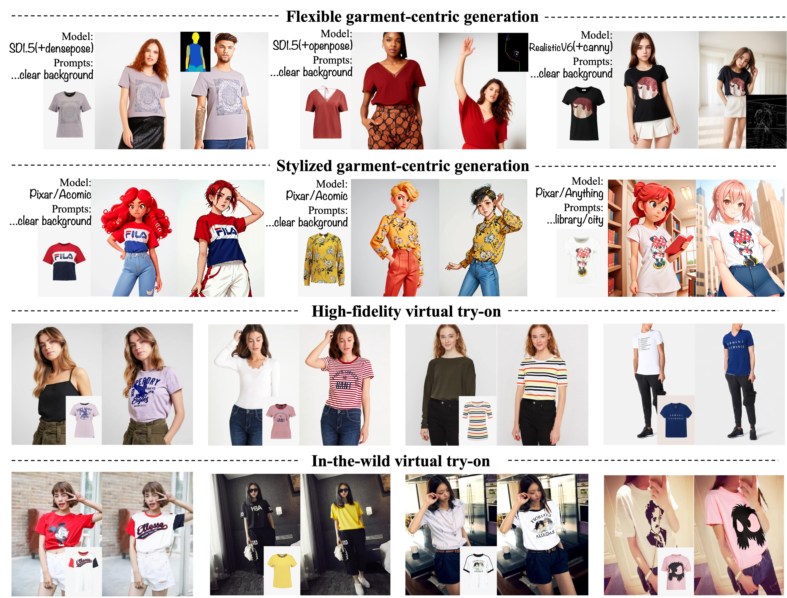

# StableGarment: Garment-Centric Generation via Stable Diffusion
This repository is the official implementation of [StableGarment](http://arxiv.org/abs/2403.10783).

[[Arxiv Paper](http://arxiv.org/abs/2403.10783)]&nbsp;
[[Website Page](https://raywang335.github.io/stablegarment.github.io/)]&nbsp;

&nbsp;

## Environments
```bash
git clone https://github.com/logn-2024/StableGarment
cd StableGarment

conda create --name StableGarment python=3.11 -y
conda activate StableGarment

pip3 install -r requirements.txt
```

## Demos, Models and Data
To acquire the VITON-HD dataset, refer to [VITON-HD](https://github.com/shadow2496/VITON-HD). Similarly, for the Dress Code dataset, visit [Dress Code](https://github.com/aimagelab/dress-code). Before testing, ensure to generate masks for the Dress Code dataset using the following command and place them in the respective directories.
```bash
python stablegarment/data/generate_mask.py
```
You can access the pretrained garment encoder for text-to-image task from [this](https://huggingface.co/loooooong/StableGarment_text2img) huggingface Repository and [this](https://huggingface.co/loooooong/StableGarment_tryon) for tryon. For convenience, the tryon model is trained on both VITON-HD and Dress Code dataset in variable resolution, so the quality is not so good as the paper. Our huggingface demo is available here [](https://huggingface.co/spaces/loooooong/StableGarment). To run the demo locally, execute the following command:
```bash
python app.py
```

## Inference
To conduct the text-to-image task with garment conditions, execute the following command. You can alter the base model to achieve different styles:
```bash
python infer_t2i.py
```
The try-on task necessitates additional inputs, primarily concerning humans. These inputs can be found in the VITON-HD and Dress Code datasets. If you intend to perform virtual try-on on arbitrary images, ensure you obtain densepose and agnostic masks akin to those in the VITON-HD dataset(this [link](https://github.com/sangyun884/HR-VITON/issues/45) may be helpful). To utilize the virtual try-on application, run the following code:
```bash
python infer_tryon.py
```

## Test
To test StableGarment on the VITON-HD dataset, execute the following command:
```bash
python test.py
```
You can adjust between paired and unpaired settings by modifying the is_pair variable. For testing on the Dress Code dataset, simply substitute the relevant variables and load the target dataset in test.py.

## Acknowledgements

Thanks to [magic-animate](https://github.com/magic-research/magic-animate/), our code is heavily based on it. 

## Citation
If you find our work useful for your research, please cite us:
```
@article{wang2024stablegarment,
  title={StableGarment: Garment-Centric Generation via Stable Diffusion},
  author={Wang, Rui and Guo, Hailong and Liu, Jiaming and Li, Huaxia and Zhao, Haibo and Tang, Xu and Hu, Yao and Tang, Hao and Li, Peipei},
  journal={arXiv preprint arXiv:2403.10783},
  year={2024}
}
```

## License
Licensed under the CC BY-NC-SA 4.0 license (https://creativecommons.org/licenses/by-nc-sa/4.0/legalcode).